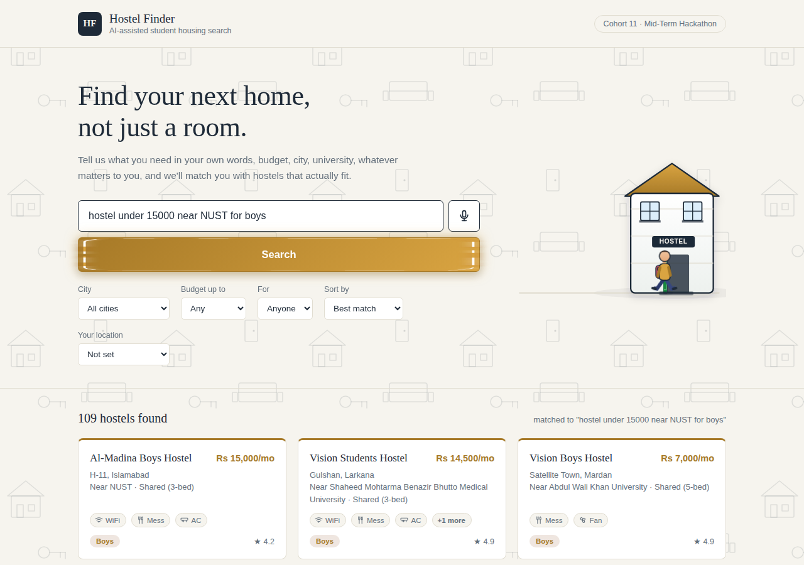

# 🏠 Hostel Finder: AI-Powered Student Housing Search

An AI-assisted platform that helps university students across Pakistan find hostels that actually match their budget, city, university, and required facilities, searched in plain English, Roman Urdu, or Urdu script, typed or spoken.

Built for: Pak Angels Generative & Agentic AI Training, Cohort 11 Mid-Term Hackathon

## 🔗 Links

| Link | URL |
|---|---|
| Live App (GitHub Pages) | [zaiba-munir.github.io/AI-Hostel-Finder](https://zaiba-munir.github.io/AI-Hostel-Finder/) |
| Live App (Streamlit) | [ai-hostel-finder-ghsqbvxptb8a7hxafxnohr.streamlit.app](https://ai-hostel-finder-ghsqbvxptb8a7hxafxnohr.streamlit.app/) |
| Source Code | [github.com/zaiba-munir/AI-Hostel-Finder](https://github.com/zaiba-munir/AI-Hostel-Finder) |
| Railway Deployment | [ai-hostel-finder-production.up.railway.app](https://ai-hostel-finder-production.up.railway.app/) |

## 📸 Screenshots

**Homepage, natural language search + quick filters**


**Search results, matched to a natural language query**


**Hostel details with facilities and WhatsApp contact**


## 👥 Team

| Name | Role |
|---|---|
| Zaiba Munir | Team Lead |
| Abdul Rehman | Member |
| Ayesha Iqbal | Member |
| Eishal Asif | Member |
| Rajeeha Kashif | Member |

## 💡 The Problem

Finding a hostel in Pakistan still means scrolling through scattered Facebook groups and WhatsApp forwards:

- Listings are unverified and scattered across many pages
- No way to search in plain words, only rigid filters
- Everything is English-only, leaving Urdu-first students out
- No sense of how far a hostel actually is, or what it will really cost

## ✅ Our Solution

Hostel Finder puts 173 real hostel listings across 30+ Pakistani cities in one place, and lets students search the way they actually talk, not the way a form expects them to.

## ✨ Key Features

- **AI-Powered Search**: The Groq API reads a free-form sentence and pulls out budget, city, gender, university, and facilities, no rigid filters needed. A safe rule-based fallback keeps search working even if the API is unavailable.
- **Voice Search**: Tap the mic and speak your search, powered by the browser's built-in speech recognition (no extra API needed).
- **Multilingual Results**: Detects English, Roman Urdu, or Urdu script and switches result labels, gender badges, and prices to match.
- **Distance & Travel Time**: Set your current city and instantly see how far each hostel is and roughly how long the trip takes.
- **One-Tap WhatsApp Contact**: Opens WhatsApp with a ready-made message (hostel name, area, rent) in the same language you searched in.
- **Quick Filters**: City, budget, gender, and sort-by, for browsing without typing a search at all.
- **Fully Responsive**: Works just as well on a phone as on a laptop.

## 🛠️ Tech Stack

| Layer | Technology |
|---|---|
| Frontend | HTML, CSS, vanilla JavaScript, no framework, no build step |
| AI Understanding | Groq API (Llama 3.3 70B), turns natural language into structured search filters |
| Backend | Node.js + Express server that keeps the AI API key secure |
| Voice Input | Browser-native Web Speech API |
| Hosting | GitHub Pages and Streamlit (live app), Railway (backend deployment) |
| Version Control | GitHub |

## 📁 What's Inside

```
AI-Hostel-Finder/
├── index.html          # Page structure: search bar, filters, results grid, modal
├── styles.css          # All styling, colors, layout, animations
├── script.js           # Search logic, AI integration, voice search, rendering
├── hostels.json         # Raw hostel dataset (also embedded in script.js)
├── app.py                # Streamlit wrapper for the live app
├── site.html               # Bundled single-file version used by app.py
├── requirements.txt          # Python dependency for Streamlit
├── backend/
│   ├── server.js               # Node/Express server (deployed on Railway)
│   ├── package.json
│   └── env.example              # Example environment variable file
└── README.md                      # This file
```

## 🚀 Run It Locally

Just open `index.html` directly in any browser, no server or build step needed for the frontend itself.

The AI search calls a small backend (`backend/server.js`) deployed on Railway, which keeps the real API key secure and never exposes it in the browser. If that backend is ever unreachable, the app automatically falls back to a reliable rule-based keyword parser, so the demo never breaks.

## 🤖 How the AI Search Works

1. The student types or speaks a query, in any language.
2. The query is sent to a small Node.js backend, which calls the Groq API with a prompt asking it to extract `budget`, `city`, `gender`, `university`, and `facilities` as JSON.
3. Groq returns structured data, understanding typos, mixed phrasing, and language switches that a fixed keyword list never could.
4. That structured data is used to score and rank the 173 hostels.
5. If the API call fails for any reason (backend asleep, no internet, quota), the app silently falls back to a rule-based keyword parser, so the demo never breaks.

## 📊 Dataset

173 hostel listings covering 30+ Pakistani cities, including Islamabad, Rawalpindi, Lahore, Karachi, Peshawar, Quetta, Multan, and smaller cities like Mingora, Gilgit, and Sukkur, each with rent, room type, gender, facilities, nearby university, and rating.

---

Hostel Finder: helping students find a home, not just a room.
